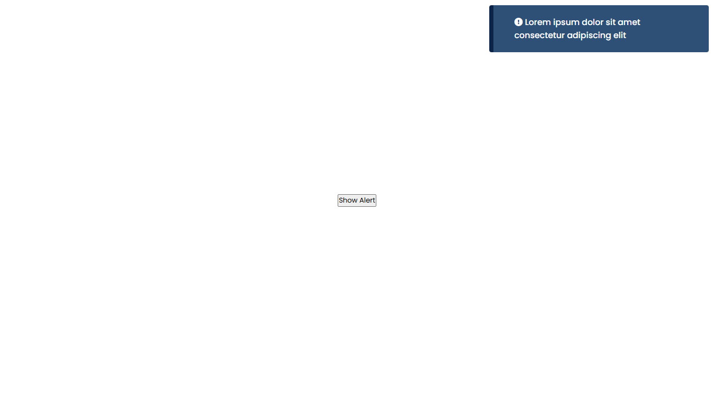

# Alert Notification Example 🚨

This is a simple **JavaScript-based warning alert notification** inspired by CodingNepal. The alert slides in from the right when the "Show Alert" button is clicked, and auto-dismisses after 5 seconds.

## 📁 Project Structure
- `index.html` – Contains the button and alert box structure
- `style.css` – Styles for the alert animation, position, and appearance
- Uses jQuery and Font Awesome via CDN

## ✨ Features
- Slide-in animation for alert
- Auto-dismiss after 5 seconds
- Manual close option (click on the alert area)
- Clean and minimal design

## 🔧 Tech Used
- HTML
- CSS (Keyframes, transitions)
- JavaScript (jQuery)

## 📸 Preview

## 📚 Credits
Based on a tutorial from [CodingNepal](https://youtu.be/hm79I2JpwJw?si=cRvv6SGzcyQ5__TH)

## 📌 Note
This is for learning/demo purposes only. The code can be extended to handle different alert types (success, warning, error) with color variations.
