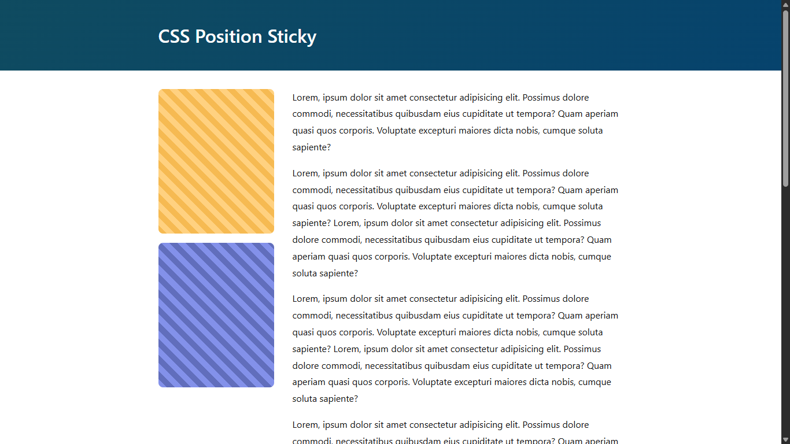

# 📌 CSS Sticky Sidebar Layout

A mini project to demonstrate how to create a sticky sidebar layout using position: sticky in CSS. The sidebar stays visible as you scroll the page content, offering a clean and responsive layout.

---

## ✨ Preview



---

## 📚 Description

This layout uses basic HTML & CSS to build a two-column layout:

- **<aside>**: A sticky sidebar containing 2 colored widgets
- **<article>**: Main content filled with multiple paragraphs to simulate scroll behavior
- The sidebar uses position: sticky with top: 2rem, so it stays visible after scrolling down

---

## 📂 File Structure


sticky-sidebar/
│
├── index.html        ← HTML structure
├── style.css         ← Styles for layout and sticky behavior
├── README.md


---

## 🧪 Key Concepts Used

- position: sticky
- CSS Grid (grid-template-columns)
- Responsive layout with max-width, margin-inline: auto
- Custom gradients and block styling for sidebar widgets

---

## ▶ How to Run

1. Open index.html in your browser  
2. Scroll down to see the sticky sidebar effect in action

---

## 🧠 What I Learned

- How sticky positioning behaves inside scrollable containers
- That the sticky element is limited by the height of its parent container
- How to mix CSS Grid with sticky elements for a flexible layout

---

## 📺 Tutorial Source

Project inspired by the following tutorial:

*📌 Video:*  
[CSS Sticky Sidebar Layout - Optimistic Web](https://youtu.be/znmdx4UZTAg?si=hErgx9pSIT3OyFuM)

---

## 📖 License
```
This project is for learning purposes only.
```
---
